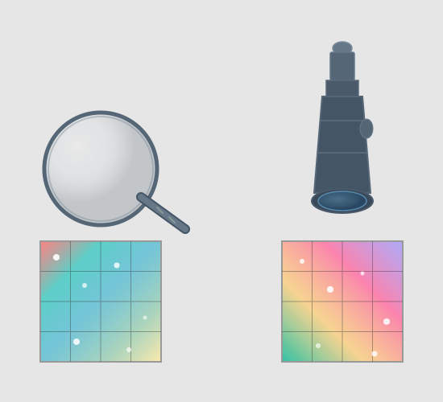
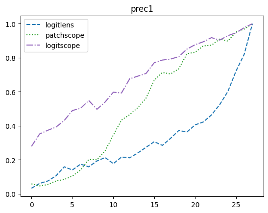
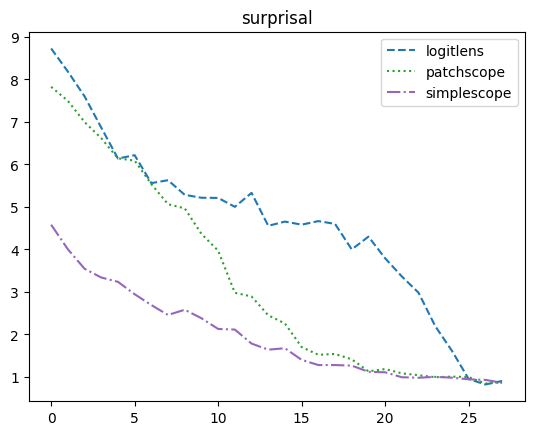

# Logitscope

A simplified and more performant next token Patchscope than the one from the [Patchscopes paper](https://arxiv.org/abs/2401.06102).

Alternatively, as a more expensive and more accurate companion to the [logit lens](https://www.lesswrong.com/posts/AcKRB8wDpdaN6v6ru/interpreting-gpt-the-logit-lens).

## Background
The **Patchscopes framework** is a general framework, introduced in the [Patchscopes paper](https://arxiv.org/abs/2401.06102), for patching residual activations from some prompt/layer/position/model into another prompt/layer/position/model.

A **Patchscope technique** is a specific parameterization of the Patchscopes framework.

**Next token extraction** is the general problem of extracting the next token of a sequence using a single residual activation somewhere in the sequence. For the problem to be non-trivial, the residual activation should not be the one in the last layer and last position. The [logit lens](https://www.lesswrong.com/posts/AcKRB8wDpdaN6v6ru/interpreting-gpt-the-logit-lens) can be viewed as a technique for solving this problem.

The **token identity Patchscope** is a specific Patchscope technique for solving the next token extraction problem. The idea is to take a prompt like `"cat -> cat\n1135 -> 1135\nhello -> hello\n?"` and patch a residual activation into the `?` token without a layer shift. For instance, it could patch the layer 5 residual of `=` in `"1+1="` into the layer 5 residual for the `?` token to see if it predicts `2`.

## Method
This project studies a new Patchscope technique for solving the next token extraction problem. It is identical to the token identity Patchscope except that it uses the prompt `"?"` instead of `"cat -> cat\n1135 -> 1135\nhello -> hello\n?"`.

The goal of this is to fix some failure modes of `"cat -> cat\n1135 -> 1135\nhello -> hello\n?"`:

1. The in-context examples show ` ->` tokens after the first tokens, so there's a bias to predicting ` ->` after the `?`.
    - Indeed, the most likely next token after `?` is ` ->` if early layers are patched, which can explain why `patchscope` has low performance in early layers.
2. If ` ->` is added to the end of the prompt, there's a bias towards predicting ` ?`.
    - This causes a significant drop in performance if ` ->` is added to the end of the prompt.

`"?"` tries to fix these two issues by removing the in-context examples:

1. On a surface level, the bias towards ` ->` gets fixed because ` ->` doesn't appear.
2. On a deeper level, the bias towards ` ?` can be viewed as a bias towards predicting the *current* token rather than the *next* token.
    - As a thought experiment, imagine patching the 0th layer pre-residual of a token like `"health"` into the `?` token in `"cat -> cat\n1135 -> 1135\nhello -> hello\n?"`. This is equivalent to the prompt `"cat -> cat\n1135 -> 1135\nhello -> hello\nhealth"`, for which the most likely next two tokens are ` -> health`, not ` -> care`. However, in the next token extraction problem, we want to extract ` care` and not ` health`.

It could perhaps be improved with different in-context examples, such as `"hello->there;?->"`. However, keeping it simple makes it feel like a more expensive and more accurate companion to the [logit lens](https://www.lesswrong.com/posts/AcKRB8wDpdaN6v6ru/interpreting-gpt-the-logit-lens), where we do the rest of the forward pass instead of skipping to the decoder. This is the rationale behind the name `logitscope`, because we use a **longer "scope" (all remaining layers)** as opposed to a **thin "lens" (decoder layer)** to observe the logits.

## Results
`logitscope` performs better than `patchscope` in both precision@1 and surprisal (the two metrics in the [Patchscopes paper](https://arxiv.org/abs/2401.06102).) with the same dataset ([The Pile](https://huggingface.co/datasets/EleutherAI/pile)) and one of the same models ([GPT-J 6B](https://huggingface.co/EleutherAI/gpt-j-6b)). I used the same preprocessing steps with slight changes: 2K examples from the start instead of after an offset of 10K, and reduced the word/character limits to avoid running out of GPU memory.

For precision@1, higher is better. For surprisal, lower is better.

## How to Run
Run `pip install -r requirements.txt` and then all cells in `logitscope.ipynb`. I ran this on an A100 80GB with 100GB of disk space, using Python 3.11.
